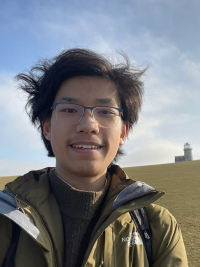

")

I ~~recently~~ graduated from Statistical Science at UCL and am ~~enjoying freedom~~ now back to school again.

I live and work in the Maths and Stats School, Parkville VIC 3010. I'm trying to get access to Peter Hall Building's G12/13. Can someone help?

# Updates

- 03/11/26: I got a disposable camera a while ago. Here's [how it went](https://blanob.github.io/archive/my-kodak-funsaver).

- 03/21/25: [ucl-stat0009](https://blanob.github.io/assets/availability-analysis.html)

- 05/01/25: [ucl-stat0045](https://blanob.github.io/assets/data-ethics.pdf)

- 05/28/25: [ucl-stat0045](https://blanob.github.io/assets/anova.pdf)

# Notes

Under construction 

# Links

To GitHub [@blanob](https://github.com/blanob/)

To bilibili [@blanobson](https://space.bilibili.com/327391613)

To [Bloomberg](https://www.bloomberg.co.jp/)

To [Webb-site.com](https://webb-site.com/)

<a href="https://github.com/blanob/blanob.github.io/">Source code</a>.

Licensed under <a href="https://creativecommons.org/licenses/by-nc-sa/4.0/">CC BY-NC-SA</a>.

Page last updated: March 11, 2025.

